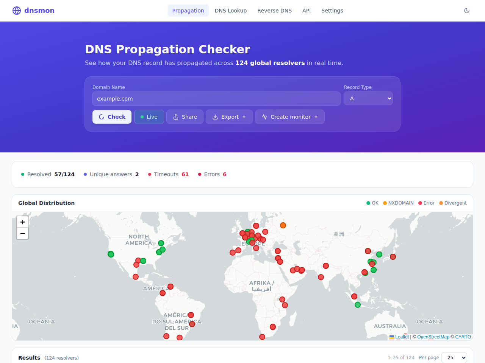
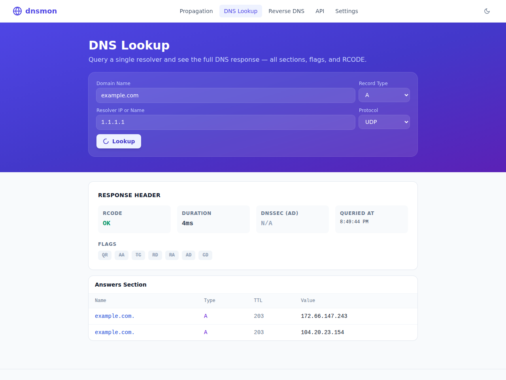
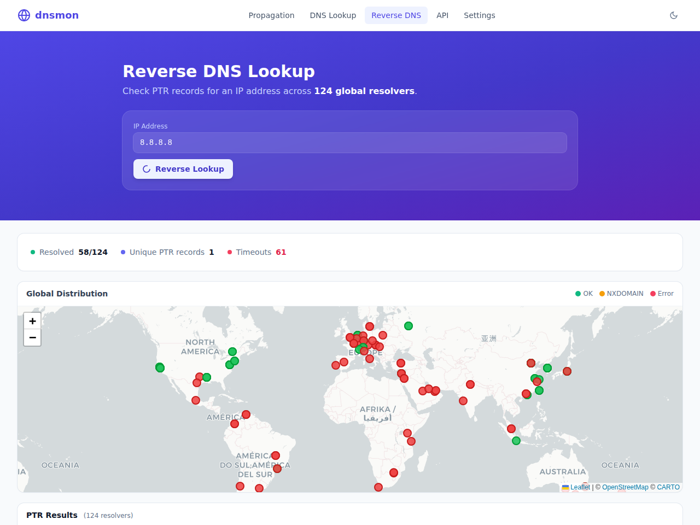
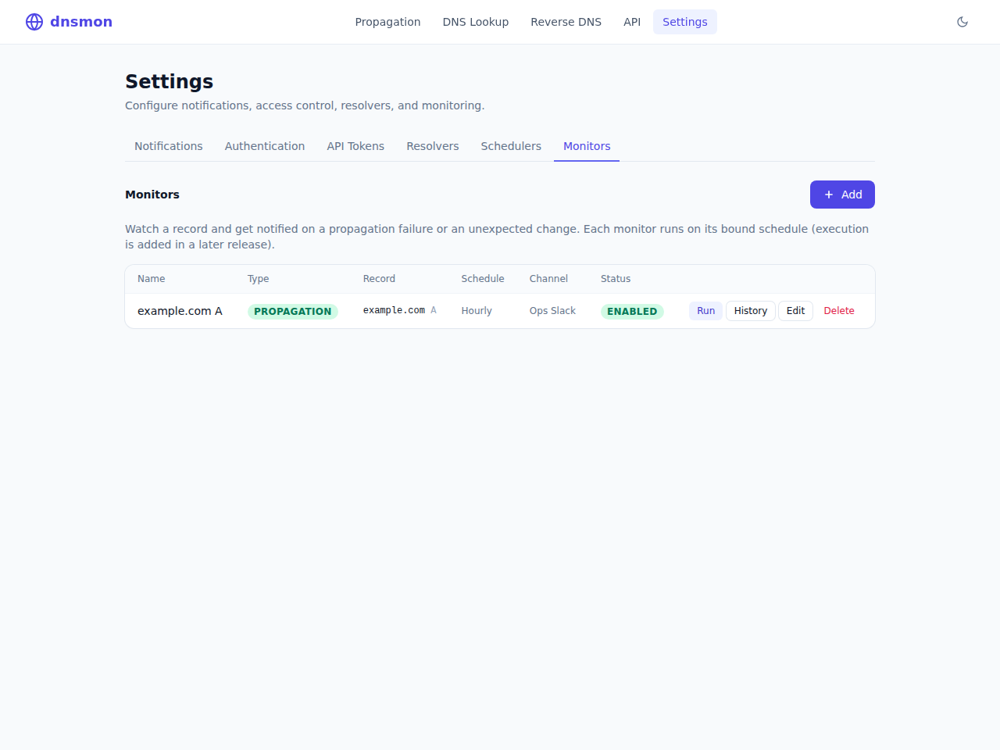
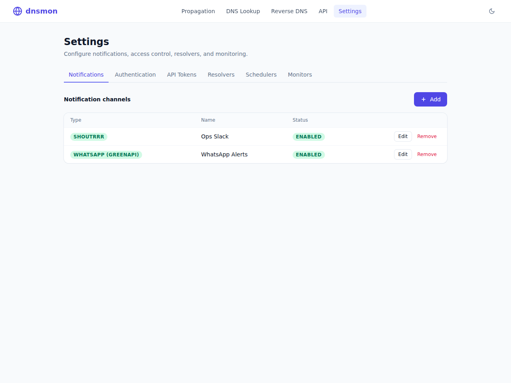
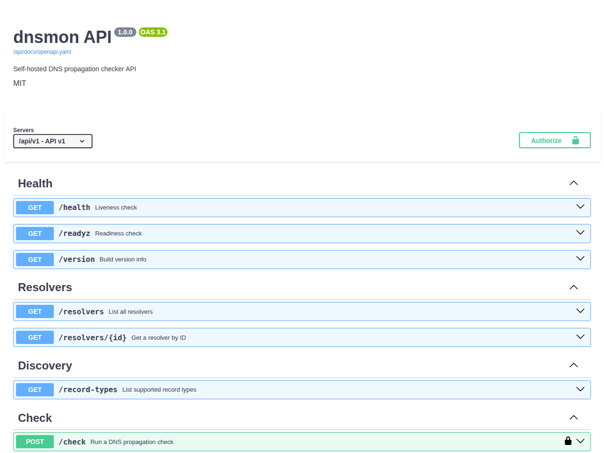

# dnsmon

**Self-hosted DNS propagation checker** — an open-source alternative to
[whatsmydns.net](https://www.whatsmydns.net/) you run inside your own
infrastructure. Check how a record resolves across **124 public resolvers**
worldwide, look up records in detail, do reverse lookups, and set up
**monitors** that alert you (Slack, Telegram, email, WhatsApp, …) when a record
fails to propagate or changes unexpectedly.

Single static Go binary with an embedded UI. `docker compose up` and you have a
private whatsmydns.



---

## Features

**DNS tools**
- 🌍 **Propagation check** across 124 curated global resolvers, with an
  interactive world map, consensus summary, country flags, and a sortable,
  paginated results table.
- ⏱️ **Propagation ETA** — estimates how long until full propagation based on
  the maximum TTL observed across resolvers still serving an old answer.
  Shows convergence % and a human-readable countdown (e.g. "~2m 30s").
- 📸 **Snapshot diff** — save a check result as a baseline, then re-run to
  see a per-resolver Δ column (changed / unchanged). A "Changed only" filter
  narrows the table to just the resolvers that flipped, making in-progress
  propagation easy to track.
- 🔗 **Authoritative trace** — walks the full DNS delegation chain from root
  nameservers down to the authoritative server, equivalent to `dig +trace`.
  Each hop shows the zone, nameserver IP, referral or authoritative status,
  answer records, and round-trip time.
- 🔎 **DNS Lookup** — full single-resolver response (Answer / Authority /
  Additional sections, TTLs, flags) against any resolver or custom IP.
- 🔁 **Reverse DNS** — PTR lookups for IPv4/IPv6 across all resolvers.
- 📡 **Live mode** — stream results as each resolver responds (WebSocket).
- 🔗 **Permalinks** and **exports** — JSON, CSV, PNG, SVG, PDF.
- 16 record types: `A AAAA CNAME MX NS PTR SOA TXT CAA SRV DS DNSKEY NAPTR TLSA SVCB HTTPS`.
- Always-fresh: response caching is **off by default**, so every check is live.

**Monitoring & alerting** (configured in **Settings**)
- 🔔 **Notification channels** — [Shoutrrr](https://containrrr.dev/shoutrrr/)
  (Slack, Telegram, Discord, email, and many more via one URL), **WhatsApp via
  GreenAPI**, and **WhatsApp via go-whatsapp-web-multidevice**. Each has a
  **Test** button.
- 🛰️ **Monitors** — two types:
  - **Propagation monitoring**: alert if the expected value hasn't propagated
    to every resolver.
  - **Change detection**: alert when a record drifts from a saved baseline
    (re-baselines after each change).
  Create one straight from a propagation check, bind it to a schedule and a
  channel, **Run** it on demand, and review its **changelog**.
- ⏱️ **Schedulers** — reusable cadences (`@hourly`, `@daily`, `@weekly`,
  `@monthly`, or a cron expression) that monitors attach to.
- 🧩 **Resolver management** — enable/disable resolvers; disabled ones are
  excluded from every check.

**Access & operations**
- 🔐 Optional **UI authentication** (single admin, argon2id-hashed, session
  cookie) — gates the Settings area when enabled.
- 🎫 **API tokens** for external/programmatic use.
- 🧰 **REST API** with **OpenAPI 3.1 docs** at `/api/docs`.
- 📈 **Prometheus metrics** at `/metrics`; `/api/v1/health`, `/readyz`,
  `/version`.
- 🖥️ CLI: `--port`, `PORT` env, and `--service install|uninstall|…` to run as a
  Windows / systemd / launchd service.
- 🌓 Dark mode, mobile-responsive, embedded UI assets.

---

## Quick start

### Docker Compose

```bash
docker compose up -d
# → http://localhost:8080  (SQLite storage in a named volume)
```

### Docker

```bash
docker run -d -p 8080:8080 -v dnsmon:/data \
  -e DNSMON_STORAGE_DSN="file:/data/dnsmon.db?cache=shared&_fk=1" \
  techblog/dnsmon:latest
```

Multi-arch images (`linux/amd64`, `arm64`, `arm/v7`) are published to
`techblog/dnsmon`.

### Prebuilt binary

Download an archive for your OS/arch from the
[Releases](https://github.com/t0mer/dnsmon/releases) page, extract, and run:

```bash
./dnsmon --port 8080
```

### Build from source

Requires Go 1.25+ and Node 20+ (Node only to compile the Tailwind CSS).

```bash
make build      # builds the UI then the binary → bin/dnsmon
./bin/dnsmon
```

Or manually:

```bash
cd web && npm ci && npm run build && cd ..
go build -o bin/dnsmon ./cmd/dnsmon
```

---

## Screenshots

| DNS Lookup | Reverse DNS |
|---|---|
|  |  |

| Monitors | Notification channels |
|---|---|
|  |  |

**API docs** (`/api/docs`)



---

## Configuration

Configure via a YAML file (`--config`), `DNSMON_*` environment variables, or
flags. Environment variables override the file; flags override both. See
[`docs/CONFIGURATION.md`](docs/CONFIGURATION.md) for every option and
[`config/config.example.yaml`](config/config.example.yaml) for a documented
example.

Common settings:

| Env | Default | Description |
|---|---|---|
| `PORT` / `DNSMON_SERVER_LISTEN` | `:8080` | Server port / listen address |
| `DNSMON_STORAGE_DRIVER` | `sqlite` | `sqlite` \| `postgres` \| `none` |
| `DNSMON_STORAGE_DSN` | `file:./dnsmon.db?cache=shared&_fk=1` | Storage DSN |
| `DNSMON_CACHE_DRIVER` | `none` | `none` (always live) \| `memory` \| `redis` |
| `DNSMON_LOG_LEVEL` / `DNSMON_LOG_FORMAT` | `info` / `json` | Logging |

### Command-line flags

| Flag | Description |
|---|---|
| `--config <path>` | Path to a YAML config file |
| `--listen <addr>` | Override the listen address (e.g. `:8080`) |
| `--port <n>` | Override just the port |
| `--log-level <lvl>` | `debug` \| `info` \| `warn` \| `error` |
| `--resolvers-file <path>` | Extra resolvers (JSON/YAML) |
| `--service <action>` | `install` \| `uninstall` \| `start` \| `stop` \| `restart` |

### Run as a system service

```bash
# Linux (root) — writes a systemd unit; Windows — run elevated
dnsmon --port 8080 --config /etc/dnsmon/config.yaml --service install
dnsmon --service start
dnsmon --service uninstall
```

---

## REST API

Base URL `/api/v1`. Interactive docs and the raw spec:

- Swagger UI: `GET /api/docs`
- OpenAPI 3.1 spec: `GET /api/docs/openapi.yaml`

Selected endpoints:

| Method | Path | Description |
|---|---|---|
| `POST` | `/api/v1/check` | Run a propagation check |
| `GET` | `/api/v1/check/stream` | Stream a check (WebSocket) |
| `GET` | `/api/v1/check/{id}/export?format=…` | Export a saved check |
| `POST` | `/api/v1/lookup` | Single-resolver detailed lookup |
| `POST` | `/api/v1/reverse` | Reverse (PTR) lookup |
| `GET` | `/api/v1/resolvers` | List resolvers |
| `GET` | `/api/v1/record-types` | Supported record types |
| `GET/PUT` | `/api/v1/settings` | Read/update settings |
| `…` | `/api/v1/settings/{tokens,schedules,monitors}` | Manage tokens, schedulers, monitors |
| `POST` | `/api/v1/settings/monitors/{id}/run` | Evaluate a monitor now |

When UI authentication is enabled, the Settings endpoints require a session
cookie (UI) or — for external use — an API token (`Authorization: Bearer …`).

---

## Development

```bash
make dev               # hot-reload dev server (air)
make test              # go test ./...
make ui-watch          # rebuild Tailwind on change
make lint              # golangci-lint
make docker            # build the image
```

Layout: `cmd/dnsmon` (entrypoint), `internal/` (config, resolvers, dnsclient,
checker, cache, storage, notify, monitor, api), `web/` (embedded SPA). See
[`docs/ARCHITECTURE.md`](docs/ARCHITECTURE.md) and
[`CLAUDE.md`](CLAUDE.md) for design details.

### Tech stack

Go · [chi](https://github.com/go-chi/chi) · [miekg/dns](https://github.com/miekg/dns) ·
[viper](https://github.com/spf13/viper) · SQLite/Postgres ·
[shoutrrr](https://github.com/containrrr/shoutrrr) ·
[kardianos/service](https://github.com/kardianos/service) · Tailwind + Alpine.js +
Leaflet (embedded).

---

## License

MIT — see [LICENSE](LICENSE).
